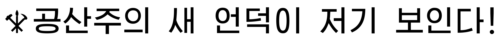
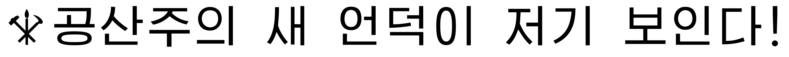
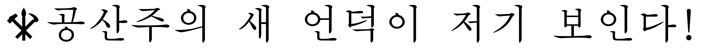
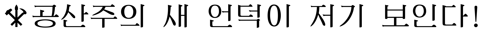

# Red Star OS 3.0 (붉은별) Fonts
Source (출처): fonts-korean-1.0.1-2.rs3.0.noarch.rpm

## Specimens
### kpcholiB.ttf

### kpcholiL.ttf

### kpcholim.ttf

### kpcholin.ttf

### kpchopoB.ttf

### kpchopoL.ttf

### kpchopom.ttf

### kpcrpyeB.ttf

### kpcrtunm.ttf

### kpkwamyB.ttf

### kpkwamym.ttf

### kppkkunM.ttf

### kppkyesB.ttf

### kppuskum.ttf

## License
It is my belief based on my reading of the law that the Kim regime's copyrights are invalid in the United States. Be careful though! He's got nukes! ☢
